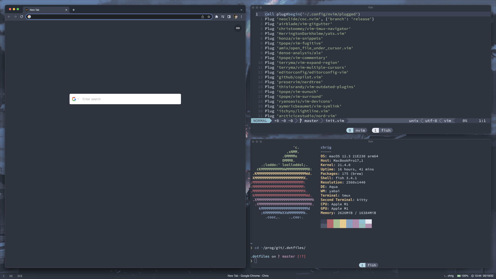

# My dotfiles



# Contents
- [Links to my environment and what I use](#links-to-my-environment-and-what-I-use)
  - [OSX Specific](#osx-specific)
  - [Linux Specific](#linux-specific)
- [References to my dotfiles](#references-to-my-dotfiles)
  - [OSX Specific](#osx-specific)
  - [Linux Specific](#linux-specific)
- [Quick Notes](#quick-notes)
- [Installation](#installation)
    - [OSX](#osx-installer)
    - [Linux](#linux-installer)
  - [Manual Installation](#manual-installation)
    - [OSX](#osx)
    - [Linux](#linux)
- [Uninstall](#uninstall)
  - [OSX](#osx-uninstaller)
    - [Brew Restore](#brew-restore)
  - [Linux](#linux-uninstaller)
- [Debugging](#debugging)

## Links to my environment and what I use
* [kitty](https://github.com/kovidgoyal/kitty/) - Terminal Emulator
* [tmux](https://github.com/tmux/tmux/wiki) - Second Terminal Emulator
  * [tpm](https://github.com/tmux-plugins/tpm) - tmux Plugin Manager
* [nord](https://www.nordtheme.com/) - Colorscheme
* [starship](https://starship.rs/) - Shell Prompt
* [fish](https://fishshell.com/) - Shell
* [neovim](https://neovim.io/) - Text Editor
  [vim-plug](https://github.com/junegunn/vim-plug) - Neovim Plugin Manager
* [SauceCodePro Nerd Font](https://github.com/ryanoasis/nerd-fonts) - Font
* [Wallpaper](wallpaper/adrenaline.png)

### OSX Specific
* [simple-bar](https://simple-bar.com/en/) - Status Bar
* [spacebar](https://github.com/cmacrae/spacebar/) - Another Status Bar
* [skhd](https://github.com/koekeishiya/skhd/) - Simple Hotkey Daemon
* [yabai](https://github.com/xorpse/yabai/) - Window Manager
* [Karabiner](https://karabiner-elements.pqrs.org/) - Keyboard Binder

### Linux Specific
* [i3wm](https://i3wm.org/) - Window Manager
* [polybar](https://github.com/polybar/polybar) - Status Bar
* [ly](https://github.com/fairyglade/ly) - Display Manager

## References to my dotfiles
* [kitty](https://github.com/rosacry/.dotfiles/blob/master/.config/kitty/kitty.conf)
* [tmux](https://github.com/rosacry/.dotfiles/blob/master/.tmux.conf)
* [starship](https://github.com/rosacry/.dotfiles/blob/master/.config/starship.toml)
* [fish](https://github.com/rosacry/.dotfiles/blob/master/.config/fish/config.fish)
  * [fish variables](https://github.com/rosacry/.dotfiles/blob/master/.config/fish/fish_variables)
  * [fish aliases](https://github.com/rosacry/.dotfiles/blob/master/.config/fish/alias.fish)
  * [fish variables](https://github.com/rosacry/.dotfiles/blob/master/.config/fish/fish_variables)
* [neovim](https://github.com/rosacry/.dotfiles/blob/master/.config/nvim/init.vim)
  * [coc-settings](https://github.com/rosacry/.dotfiles/blob/master/.config/nvim/coc-settings.json)
* [stow](https://github.com/rosacry/.dotfiles/blob/master/.stowrc)

### OSX Specific
* [spacebar](https://github.com/rosacry/.dotfiles/blob/master/.config/spacebar/spacebarrc)
* [skhd](https://github.com/rosacry/.dotfiles/blob/master/.skhdrc)
* [yabai](https://github.com/rosacry/.dotfiles/blob/master/.yabairc)
* [karabiner](https://github.com/rosacry/.dotfiles/blob/master/karabiner.json)
* [via (DZ60) layout](https://github.com/rosacry/.dotfiles/blob/master/dz60rgb_v2.json)

### Linux Specific
* [i3wm]()
* [polybar]()
* [ly]()

## Quick Notes
*  For M1 Macbooks running Catalina and Monterey, you must go through [this](https://github.com/koekeishiya/yabai/issues/1054) forum in order to get the full use case of [yabai](https://github.com/xorpse/yabai/). Once you go into recovery mode when following the fourm, you can also enable access to unverified/unidentified developer apps on mac using
```
sudo spctl –master-disable
 ```
 This command is completely optional, but I enabled it to allow keybinds to open programs such as the kitty terminal emulator
* Don't forget to authenticate to [Github CLI](https://cli.github.com/) using `gh auth login` and [Github Copilot](https://copilot.github.com/) using `:Copilot setup` if you're using either one
* Make sure to install `wget` before continuing with installing


## Installation
### OSX Installer
```
wget https://raw.githubusercontent.com/rosacry/.dotfiles/master/installers/macInstall.sh && ./macInstall.sh
```
### Linux Installer
```
wget https://raw.githubusercontent.com/rosacry/.dotfiles/master/installers/linuxInstall.sh && ./linuxInstall.sh
```
### Manual Installation
#### OSX
Install [Homebrew](https://brew.sh/)
```
/bin/bash -c "$(curl -fsSL https://raw.githubusercontent.com/Homebrew/install/HEAD/install.sh)"
```
Install [Git](https://git-scm.com/) and [Stow](https://www.gnu.org/software/stow/manual/stow.html), if you want to use [Github CLI](https://cli.github.com/), simply change `git` in `brew install git` to `gh`, then authenticate using `gh auth login` after installing
```
brew install git && brew install stow
```
Clone my repository
```
git clone https://github.com/rosacry/.dotfiles.git
```
Change Directory to the Directory the repository was cloned to
```
cd .dotfiles
```
Use [Stow](https://www.gnu.org/software/stow/manual/stow.html) to copy and link these files to the same one's in the repository
```
stow --adopt -t ~/ .
```
Now we can `git pull` in this local repository if there are ever changes/updates made to the online repository

If you already have [homebrew](https://brew.sh/) installed and want to add on to your current packages, run this command in the .dotfile directory
```
./installers/brewInstaller.sh
```
`BackupBrew` has been created in the .dotfiles directory in any case you decide to revert back to your original brew packages, if you decide to, you can run the next command, replacing `BrewfileName` with the backup you created called `BackupBrew`
If this is your first time installing homebrew you can skip the previous step and download my packages list
```
brew bundle --file=(BrewfileName)
```
Add [fish](https://fishshell.com/) to shells list `/etc/shells` and update default shell to fish
```
which fish >> /etc/shells && chsh -s /opt/homebrew/bin/fish
```
Update brew
```
brew update && brew upgrade
```
Install and Update [vim-plug](https://github.com/junegunn/vim-plug)[neovim](https://neovim.io/) plugins, in `nvim` type
```
sh -c 'curl -fLo "${XDG_DATA_HOME:-$HOME/.local/share}"/nvim/site/autoload/plug.vim --create-dirs \
       https://raw.githubusercontent.com/junegunn/vim-plug/master/plug.vim'
 && mkdir ~/.config/nvim/plugged && nvim +PlugInstall +CocInstall +qa!
```
In [tmux](https://github.com/tmux/tmux/wiki), I mapped this to `prefix+p`/```-p``
Install tmux plugin manager, [tpm]($ git clone https://github.com/tmux-plugins/tpm ~/.tmux/plugins/tpm)
```
git clone https://github.com/tmux-plugins/tpm ~/.tmux/plugins/tpm
```
If you are running OSX >= 10.15.5 with tmux >= 3.1b, follow these steps to enable true (256) colors
```
sudo curl -LO https://invisible-island.net/datafiles/current/terminfo.src.gz && gunzip terminfo.src.gz && /usr/bin/tic -xe tmux-256color terminfo.src && tmux info | grep -e RGB -e Tc
```
#### Optional
##### Disable animations when opening and closing windows.
```
defaults write NSGlobalDomain NSAutomaticWindowAnimationsEnabled -bool false
```

##### Accelerated playback when adjusting the window size.
```
defaults write NSGlobalDomain NSWindowResizeTime -float 0.001
```
#### Enable access to unverified/unidentified developer apps on mac (must execute in recovery mode)
```
sudo spctl –master-disable
```

#### Linux
wip

## Uninstall
`cd` into the `.dotfiles` directory, then run the following shell script based on your OS
### OSX Uninstaller
```
./uninstallers/macUninstall.sh
```
#### Brew Restore
```
./uninstallers/brewRestore.sh
```
### Linux Uninstaller
```
./uninstallers/linuxUninstall.sh
```
### Debugging
* try rebooting
